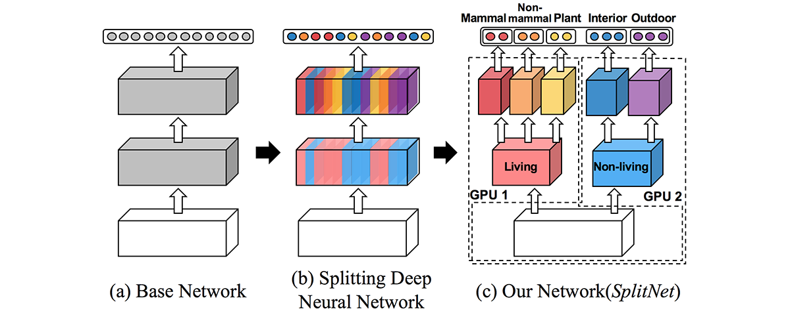
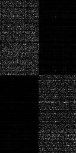
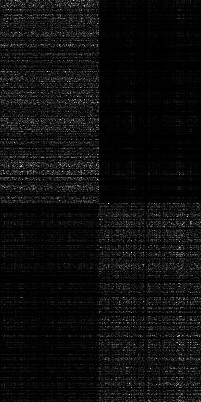

# SplitNet PyTorch Implementation

PyTorch implementation of [SplitNet: Learning to Semantically Split Deep Networks for Parameter Reduction and Model Parallelization, ICML 2017](http://proceedings.mlr.press/v70/kim17b/kim17b.pdf)




## Results

Learned Convolution Filters of *g2-b1-w3 (left)* and *g3-b1-w3 (right)*.

 

Learned Group Indicators of *g2-b2-p (left)* and *g3-b2-p (right)*.

 


## Installation
```
$ git clone https://github.com:kuc2477/dl-papers && cd dl-papers
$ pip install -r requirements.txt
```

## CLI
Implementation CLI is provided by `main.py`.

#### Usage 
```
$ ./main.py --help
$ usage: SplitNet torch implementation [-h] [--dataset {cifar10,mnist,cifar100}]
                                 [--total-block-number TOTAL_BLOCK_NUMBER]
                                 [--widen-factor WIDEN_FACTOR]
                                 [--baseline-strides BASELINE_STRIDES [BASELINE_STRIDES ...]]
                                 [--baseline-channels BASELINE_CHANNELS [BASELINE_CHANNELS ...]]
                                 [--split-sizes SPLIT_SIZES [SPLIT_SIZES ...]]
                                 [--gamma1 GAMMA1] [--gamma2 GAMMA2]
                                 [--gamma3 GAMMA3]
                                 [--weight-decay WEIGHT_DECAY]
                                 [--dropout-prob DROPOUT_PROB] [--lr LR]
                                 [--lr-decay LR_DECAY]
                                 [--lr-decay-epochs LR_DECAY_EPOCHS [LR_DECAY_EPOCHS ...]]
                                 [--epochs EPOCHS] [--batch-size BATCH_SIZE]
                                 [--test-size TEST_SIZE]
                                 [--eval-log-interval EVAL_LOG_INTERVAL]
                                 [--loss-log-interval LOSS_LOG_INTERVAL]
                                 [--weight-log-interval WEIGHT_LOG_INTERVAL]
                                 [--checkpoint-interval CHECKPOINT_INTERVAL]
                                 [--model-dir MODEL_DIR]
                                 [--resume-best | --resume-latest] [--best]
                                 [--no-gpus] (--test | --train)
 
```

#### Train
```
$ python -m visom.server &
$ ./main.py --train [--resume-latest|--resume-best]
```

#### Test
```
$ ./main.py --test
```


## Note
- Block diagonal weight utilizing test phase is not implemented yet.


## Reference
* [splitnet-wrn](https://github.com/dalgu90/splitnet-wrn)
* [SplitNet: Learning to Semantically Split Deep Networks for Parameter Reduction and Model Parallelization, ICML 2017](http://proceedings.mlr.press/v70/kim17b/kim17b.pdf)


## Author
Ha Junsoo / [@kuc2477](https://github.com/kuc2477) / MIT License
